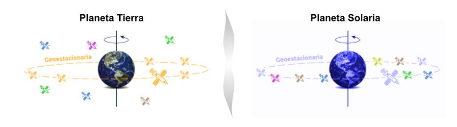
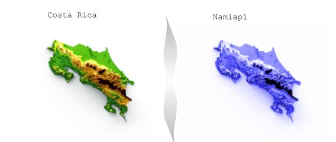

Tecnológico de Costa Rica  
Escuela de Ingeniería en Computación  
IC: 7602-Redes  - 2 Semestre 2022   
2018093728 - Paula Mariana Bustos Vargas
____

 <h1> Examen de Redes - V 11-11-2022 </h1> 
 

**Pregunta 1 (40 pts)**

La estación espacial Deep Space 13, será puesta en operación en el verano del año 5698, conocido como el año 2 e.E, la misma estará en una órbita geoestacionaria en el planeta Solaria, el cual es un gemelo idéntico de la Tierra. 

Al llegar al planeta Solaria, la estación desplegará un enjambre de satélites, cada satélite será colocado en una órbita geoestacionaria sobre el ecuador de Solaria, esto permitirá la formación de un anillo de satélites de comunicación junto con la estación espacial, solo un elemento de la formación tendrá comunicación directa con la Tierra, esto implica que cuando la estación se encuentra fuera del alcance de la Tierra, las comunicaciones provenientes de esta, son recibidas por un satélite y estas son enviadas a la estación de forma similar a como funciona un token ring, de igual forma las comunicaciones salientes de la estación serán enviadas a varios satélites hasta encontrar el adecuado que tiene conexión con la Tierra. 

La distancia entre la Tierra y la esta estación es de alrededor de 400 millones de kilómetros. Deep Space 13 es una estación internacional, esto implica que existen ciudadanos de todos los países viviendo en esta y se tienen que garantizar comunicaciones entre la estación y la tierra.

Lucky Starr Tech ha sido contratada para realizar una propuesta de cómo se implementaría la comunicación en el planeta Solaria en caso de realizar una colonización de este, los reportes iniciales es que en el planeta Solaria no existe vida inteligente, para esta primera etapa se iniciara con la colonización del territorio que será conocido como Namiapí, el cual corresponde a una superficie de 51180 km2 y es idéntico al territorio centroamericano conocido como Costa Rica, como se mencionó anteriormente el planeta Solaria es un gemelo idéntico de la Tierra.

Lucky Starr Tech tiene que realizar una propuesta de la capa física que utilizaría para garantizar las comunicaciones en todo Namiapí, debe justificar ¿por qué seleccionó esta capa física?, puede incluir diagramas para apoyar sus deducciones. Es muy importante hacer un uso eficiente de los recursos que se pueden transportar desde la tierra y es aún más importante mencionar que las comunicaciones deberán de estar en operación en menos de dos años en todo el territorio de Namiapí, no importa la velocidad, pero tiene que existir comunicación.

En calidad de CTO de la empresa ustedes tienen que elaborar y justificar esta propuesta detalladamente. 

**Respuesta**

<u>Datos a considerar:</u>

- órbita geoestacionaria: orbita en plano de ecuatorial terrestre donde se encuentran satélites que vuelan a grandes alturas 
- gemelo idéntico de la Tierra: todo es idéntico al planeta Tierra, cualquier dispositivos de red que funcione en la Tierra funciona en el planeta Solario
- Visualización  de planeta Solaria y los satélites  GEO en comparativa con el planeta Tierra

Solo un satélitea la vez tiene linea vista con la Tierra (comunicación con la Tierra)

Deep Space 13
 - estación espacial que tiene ciudadanos de todos los países viviendo en esta.
 - garantizar comunicaciones entre la estación y la tierra

- Existiria un tipo de conexión satelital, inalámbrica y a nivel superficie podira existir fisica en accesos fijos por cobre, debido a que las estaciones tienen que estar en comunicación, más la conexión en las diversas secciones del planeta y se necesita que sea posible en 2 años

Comunicación en el planeta Solaria en el territorio Namiapí seccion identica al territorio de Costa Rica.

<u>Propuesta de capa fisica:</u>

Entre los medios a utilizar los los datos a considerar antes planteados serian
- Medio dirigido el cual seria un cable coaxial le confieren una buena combinación de ancho de banda alto y excelente inmunidad al ruido. El ancho de banda posible depende de la calidad y longitud del cable, y de la relación señal a ruido de la señal de datos.  Los cables coaxiales solían ser ampliamente usados en el sistema telefónico para las líneas de larga distancia por lo cual se podria plantear en este proceso de colonizacion volverlos a utilizar. Ademas de que no es tan costoso como otros medios dirigidos como la fibra optica, su instacion es menos compleja. Como se menciono anteriormente tienen una inmunidad al ruido muy buena y no es tan problematico/delicado con respecto a situaciones o agentes externos en la cuestion del ingreso de ruido al medio.

- Medios inalambricos la cual se estaria proponiendo la radiotransmision debido a que las ondas de radio son fáciles de generar, pueden viajar distancias largas y penetrar obstaculos sin problemas y estas ondas que generan viajan en todas direcciones a partir de la fuente, por lo que no es necesario que el transmisor y el receptor se encuentren alineados físicamente.

Tambien que se posee las bandas donde las ondas de radio siguen la curvatura del planeta.

- Medio satelital la cual seria la conexión a la estación espacial Deep Space 13.

El planteamiento principal seria que al tener que minimizar en la duracion y los recursos disponibles, se plantea que el foco de transmision de los datos sea por medio satelital y Torres de radio frecuencia para la distribucion posicionadas de manera estrategicas; además de que estos tambien puedan estar conectados por medio de un cable coaxial para la transmision de manera más planificada para hacer el mejor uso del materia, al igual si se diece el caso de tener usuarios de red conectados por este medio 

Ademas de que con los satélites, es factible que un usuario instale una antena en el techo de la casa y evada por completo el sistema telefónico para conseguir un ancho de banda alto. Ademas de que él despliegue es rápido  debido a que ya estos exisitirian en la orbita geoestacionaria. Y tambien se tendria la coneccion directa de la estacion con la supefice del planeta y se podria lograr en 2 años.

____________________________
**Pregunta 2 (30 pts)**

Corría el año de 1993, en Costa Rica se encontraba de moda un programa de televisión llamado Nube Luz, todos los niños y niñas les gustaba verlo y cantar sus canciones, por esta misma época, un niño algo curioso recibió uno de los mejores regalos de su vida por parte de su madre y padre, unos Radios Walkie Talkie, este niño se preguntaba como su voz podía ingresar al dispositivo y aparecer en el otro dispositivo. Un día este niño viajo a Cristo Rey de Alajuela donde vivía una prima, esta localidad es cercana al Aeropuerto Juan Santamaria y llevó consigo los Radios Walkie Talkie, este niño y su prima se pusieron a transmitir las canciones de Nube Luz colocando un Radio Walkie Talkie cerca a la bocina del televisor y escuchando las canciones en el otro Radio Walkie Talkie y se alejaban hasta que la transmisión se cortaba, de un momento a otro se escucho una voz en este radio ajeno al programa de televisión, resultó ser un operador aéreo del aeropuerto Juan Santamaria, esta persona estaba muy molesta porque una frecuencia importante fue invadida por una niña y un niño inocentes, que simplemente estaban jugando.

**<u>Explique:</u>**

• **Desde un punto de vista técnico, ¿Por qué razón se presentó este incidente?**

El principal factor por el cual se presento el incidente era por la falta de regularizacion en el uso de frecuencias de los dipositivos, y ya la razon por la cual se dio el incidente fisicamente hablando fue debido a que un juguete/dispositivo como el Walkie Talkie al salirse del rango de comunicación que tenia con el otro dispostivo en cuestion entre a una banda de frecuencia que era utilizada por aeropuerto para sus comunicaciones.

Ademas de que la potencia que utiliza la comunicación de un aeropuerto era mayor a la que generaria un Walkie Talkie, por lo cual no es de extrañar que se diece la recepcion del espectro transmision que se estaba dando por la frecuencia departe del aeropuerto.

• **¿Por qué es necesaria la regulación de uso de frecuencias?**

Primeramenta por una cuestion de seguridad de los datos y que estos no se puedan utilizar de manera equivocada o bien utilizar el medio para generar alguna accion malisiosa.

En un segundo punto seria tener bandas de frecuencias especificas para comunicación que necesitan una alta prioridad como es el caso de un aterrizaje de un avion o para evitar colisiones de estos en el aire por dar un ejemplo. Lo cual trataria de evitar principalmente que se den colisiones e interferencias por este medio.

Finalmente como se mencionaba antes para evitar colisiones, interferencia y regulizar tambien la radicion que se podria general y tambien que se utilice de la mejora manera posible del ancho de banda 

• **¿Por qué se debe certificar los dispositivos y limitar su frecuencia de transmisión?**

Principalmente para disminur lo más que se pueda acciones maliciosas, segundo debido a regulaciones gubernamentales internacionales que tambien se utilizan a nivel nacional y tercero para el aprovechamiento del envio de datos, ya sea por medio, ademas de evitar la perdida de datos, por colisiones o interfencias y por ende se tendria una aprovechamiento mayor en ancho de banda.

• **¿Por qué la privacidad va de la mano con las redes? En especial en medios inalámbricos.**

Debido a la proteccion de datos, evitar acciones maliciosas. Ademas de que no se sabe quien esta accediendo a estos datos.

• **Suponiendo que se encuentran en el año 1993, ¿Qué solución darían para evitar este problema?**

En las especificaciones del dispositivo en este caso el Walkie Talkie la distancia a utilizarlos, tambien que tuvieran a nivel interno algun tipo de seguridad que solo permitiese el ingreso de datos que probengan del dispositivo, en este caso unicamente la transferencia de la pareja de los Wlakie Talkies

Pariendo del supuesto que una situacion como la que se presenta anteriormente se hubiera dado con anterioridad, por parte del aeropuerto pondria prohibiciones de que es cercanias a este no se puedan utilizar este tipo de dispositivos.

Finalmente a nivel del aeropuerto una mejor seguridad en la cuestion del manejo de las transmisiones, ya sea teniendo algun tipo de herramienta que detecte la intromision de dispositivos externos que genere un cambio automatico o bien bloqueo de este.

____________________________
**Pregunta 3 (15 pts)**

Desde un punto de vista de congestión a nivel de capa de red:

• **¿Por qué razón overprovisioning de hardware no es una herramienta efectiva para lidiar con la congestión? (10 pts)**

Debido a que esto lo unico que esta generando es ampliando la red, al comprar dispositivos hardward más de los necesarios y por ende las rutas por los cuales los paquetes van a pasar se amplian lo cual no soluciona el problema de congestion el cual era el problema principal ya que puede ser el caso de que se alargue o traslade a otro dispositivo que se añadio al finalizar o bien que se mantenga en su posicion, pero siempre se va a manterne el problema.Ademas de que se añade la posibilidad de que aumente la probabilidad de perdida de datos y aumento de duracion en la trasmision de estos y un gasto de recursos.

Más bien se deberia de e aplica un control de congestión al hardward que ya se posee:
1. Monitoreando el sistema para detectar cuándo y dónde ocurren congestiones.
2. Pasar esta información a lugares en los que puedan llevarse a cabo acciones.
3. Ajustar la operación del sistema para corregir el problema.

O bien utilizando politicas de prevencion de congestion como lo son:
- Circuitos virtuales vs. datagramas en la subred
-  Política de encolamiento y servicio de paquetes
-  Política de descarte de paquetes
-  Algoritmo de enrutamiento
-  Administración de tiempo de vida del paquete

• **¿Como el uso de Inteligencia Artificial (IA) y el análisis de tráfico de capa de red, puede ayudar a tomar decisiones más adecuadas para asegurar un QoS en la red, será posible implementar prioridad de tráfico basado en IA? (5 pts)**

QoS: calidad de servicio

Si y no, primeramente porque no se tiene una tecnica proporciona QoS eficiente y confiable de una manera óptima, por lo cual podrian existir situaciones donde la prioridad designada no sea la correcta. Luego se tiene que tambien en los casos de que vengan encriptados como fue el caso expuesto en la clases, ya que la IA no llegaria a comprender los datos que puedan venir encriptados lo que podria hacer es marcalos de alguna manera o bien identificarlos como que traen basura y dar algun tipo de notificacion por lo que no le seria posible darle una

Dicho lo anterior, sí podria llegar con la IA y el analisis de trafico poder generar alguna ayudar a tomar sobre la decisiones más adecuadas para asegurar un QoS en la red, para dar distintas prioridades al trafico aunque esta no complentamente optima ni confiable.

____________________________
**Pregunta 4 (15 pts)**

El ancho de banda es el recurso más importante en redes, hacer un uso eficiente y adecuado de este es primordial tanto en clientes como servidores y en todos los dispositivos por los que pasa un paquete cuando viaja de un punto a otro en Internet (network hops).

**<u>Explique en detalle:</u>**

- **¿Cómo afectan los saltos entre routers el round-trip time de un paquete entre dos puntos de Internet? ¿Cómo afecta el MTU este tiempo y como nos beneficia conocer el mínimo MTU? Discuta las implicaciones de clientes, servidores y dispositivos de red intermedios (routers) que participan en la comunicación. (10 pts)**

Los saltos entre routers que da un paquete entre dos puntos de Internet afectan directamente en el round-trip time de un paquete debido a que este es proporcional al tiempo que dure realizando el viaje. Ademas de que el mayoria de las situaciones se tiene un contador de los posibles saltos que puede hacer un paquete antes de llegar a su destino si no se desecha al igual de manera viceversa que despues de haber pasado cierta cantidad de tiempo y que no haya llegado a su destino este se procede a desechar. Por lo cual ambos estan relacionados

El MTU el cual es la unidad máxima de transferencia que posee cada red. Es el que define el límite superior del tamaño del paquete que se va a trasmitir por la red. Al conocer este y pasar los paquetes de dicho tamaño se beneficia en que no se van a tener que estar dividiendo a lo largo de la red, por lo que se evita el extravido de memoria, un mejor aprovecamiento de los recursos y del ancho de banda. Ademas de que agiliza el proceso de trasmision de paquetes por los que el tiempo antes mencionado va hacer el menor posible ya que se ahorra procesos secundarios como la division del paquete ya que no es necesario. Y esto se da a lo largo de toda la red es decir los clientes, servidores y dispositivos de red intermedios (routers) que participan en la comunicación.

- **¿Cómo el uso de caches regionales (cerca del usuario) pueden ayudar a reducir la cantidad de saltos, reducir el round-trip time y hacer un uso eficiente del ancho de banda? Discuta las implicaciones para clientes, servidores y dispositivos de red intermedios. (5 pts)**

El cache permite tener informacion esencial a utilizar que no tienen altos cambios por lo que no se necesita estar actualizando toda esta informacion constantemente, sino actualizarla con alguna frecuencia,o bien solo un semgento con debe de hacer elactualizado y enviado para la ejecucion. Como es el caso del navegador que se explico en clase que en vez de estar actualizando toda la información del navegador en cada consulta solo se hacia despues de un tiempo transcurrido determinado se volvia a realizar dicha actualizacion que se volvia a guardar en el cache. 

Lo que ayuda que el tiempo que dura la realizacion de la consulta sea menor ya que no se estan pasando paquetes de informacion redundaste, tambien se disminuye la cantidad de datos ya que tambien se puede tener la ruta a seguir el paquete y otro de los uso es para la prevension de congestion debido a que solamente se esta haciendo el envio de la informaicon necesaria y no repetitiva, se da una transmision de datos selectiva. 

Además de que utiliza de manera eficiente los recursos que tiene a su disposicion y el ancho de banda.

El principal problema que presenta el uso de caches regionales es que algunas veces este cahce no se refresca o bien se ensucia ya sea con datos anteriores o externos y el navegador o herramienta que lo este utilizando no tiene como limpiarlo automaticamente, esto genera errores dentro la consistencia de los datos.