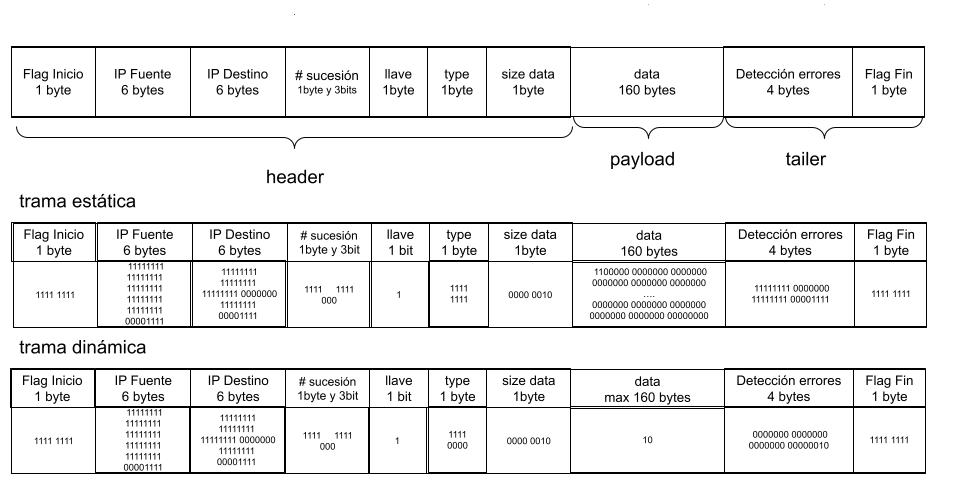

Tecnológico de Costa Rica  
Escuela de Ingeniería en Computación  
IC: 7602-Redes  - 2 Semestre 2022   
2018093728 - Paula Mariana Bustos Vargas
______________________

 <h1> Prueba Corta 7 y 8 </h1> 
 
<h2>Diseñar la trama que será utilizada por el protocolo, algunos detalles importantes (70 pts) : </h2>

- Los identificadores de destino y fuente tienen un total de 6 octetos cada uno.
-  El tamaño máximo del payload (datos) que puede llevar la trama es de 160 bytes, esto debido a que tramas muy - grandes pueden causar muchos problemas.
- El contenido puede ir encriptado con llave pública/privada.
-  Se debe garantizar la entrega en orden de las tramas.
-  Se debe verificar que los datos estén correctos.
-  Se debe tomar en cuenta que pueden existir diferentes tipos de tramas.
-  Se debe hacer una propuesta con trama de tamaño variable (entre 0 y 160 octetos) y otra con trama de tamaño fijo.
-  El header incluyendo la verificación debe ser lo más pequeño posible, se debe trabajar bajo el supuesto de que la trama debe ser lo más pequeña posible. Su propuesta debe hacer un uso eficiente del espacio, debe especificar
cuántos bits se van a usar por campo en su trama.

**Trama**

Se tiene un flag de un byte que dara a conocer cuando inicia y cuando termina. Se tiene un espacio para saber cual numero es se designo que el tope de numero de seguimiento seria 2047. Luego una seccion para la validacion de errores, pensando que se utilice hamming o algun otro algoritmo para deteccion de datos, y en el caso de la data lo definira el tipo de como proceda. 

En el caso de la trama estatica uno le define el tamaño de la data, se necesita saber el tamaño de la data en el ejemplo seria de 2 por lo que se aconstumbra a completar con cero, el resto de bytes que se designaron.

En el caso de la trama dinamica uno necesita saber el tamaño de la data para que sepa que se esta leyendo la data y no lea segmentos que no sean parte de la data.
______________________

<h3> Explique detalladamente la razón por la cual Internet Protocol se implementa como un servicio sin conexión en lugar de un servicio orientado a conexión (30 pts).</h3>

Un protocolo orientado a la conexión es un modo de comunicación de redes donde se debe establecer una conexión antes de transferir datos. Pero al utilizar el IP genera que uno no responda por el mismo puerto por el cual se realizo la solicitud, ademas de que cada paquete es individual debido a que el medio no es confiable, por lo cual los paquetes al saber su llegada de destino podran obtar por la mejor ruta. 

